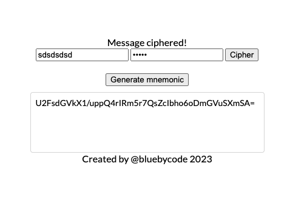

````
NodeToTypescript: An example of 'Node+Typescript' project in which 'Typescript' sources can be
packed as 'javascript' sources on '/dist' folder (see webpack.config.js). The example is a
AES encryption box which can also generate random 'mnemonic' thanks to the library crypto-js.
Update: The 'crypto-js' project is has been discontinued. Nowadays, NodeJS and modern 
browsers have a native 'Crypto' module.

References:
- BIP39 project: https://github.com/bitcoinjs/bip39
- Crypto Browser's module: https://developer.mozilla.org/en-US/docs/Web/API/Crypto
- Mnemonic https://medium.com/coinmonks/mnemonic-generation-bip39-simply-explained-e9ac18db9477
- AES Encryption https://en.wikipedia.org/wiki/Advanced_Encryption_Standard
https://medium.com/@adarsh-d/aes-encryption-and-decryption-in-javascript-using-cryptojs-81b57205711d

Instructions:
npm install
npx webpack
open index.html
```

